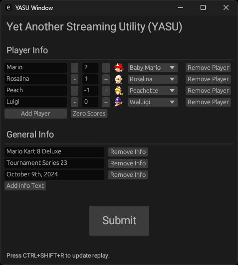

# YASU: Yet Another Stream Utility

## Overview

A program to help assist in streaming. Provides a simple interface for dynamic editing of stream-related content. Currently focuses on score keeping in the context of a game.

This is written in Rust, using EGUI.

## Screenshot

## Configuration

Most primarily, one will want to use a streaming / recording tool, such as [Open Broadcaster Software (OBS)](https://obsproject.com). While as much as possible is made to be generic, the app was objectively developed with OBS in mind, and thus any instruction should be taken in this context.

All interaction done within YASU will result in file updates to the files in the `output` directory. You should point your OBS to these files.

- Text:
  - Make `Text (GDI+)` objects in an OBS scene, check `Read from file`, and direct them to something like `path/to/YASU/output/player_1.txt`. Do this for all relevant output files (you may need to use the app to make sure a file is created) and OBS should be auto-updating as needed.

- Image:
  - Fill the `images` directory with images that you want to select between, such as character icons.
  - Make an `Image` object in an OBS scene, and direct it to something like `path/to/YASU/output/image_1.png`. Do this for all relevant output files (you may need to use the app to make sure a file is created) and OBS should be auto-updating as needed.

- Replay:
  - [Enable the replay buffer in OBS.](https://www.nicoleven.com/how-to-enable-replay-on-your-live-stream-with-obs-studio/)
  - Set the hotkey for `Save Replay` to `Ctrl + Shift + R` in order to match with this app.
  - Make a `Media Source` object in an OBS scene, and direct it to something like `path/to/YASU/output/replay.mp4`: you will need to use the app to make sure a file is created. Check `Close file when inactive` on that media source.
  - Run the app with the command line arguments as needed:
    - `obs-replay-path` (default `C:\\Users\\User\\Videos\\`)
    - `obs-video-ext` (default `.mp4`)
    - `replay-save-delay` (default `4` (seconds))
  - Press CTRL+SHIFT+R while in YASU, with the OBS replay buffer running, and not on the same scene as your replay Media Source.

## Contact

Email benjamin.w.massey@gmail.com for any questions / inquiries.
